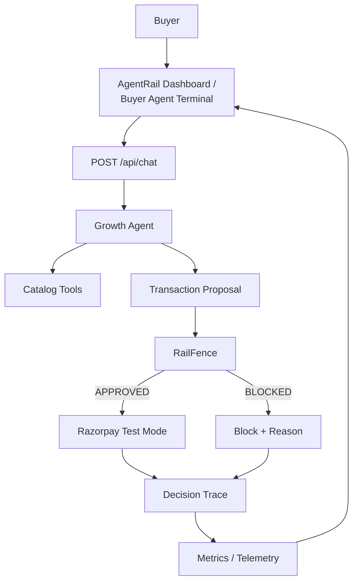

# AgentRail

AgentRail is an AI Growth Agent for merchant-side agentic commerce. The Growth Agent acts as the primary intelligence layer—understanding buyer intent, searching the real catalog, identifying upsell and cross-sell opportunities, and autonomously generating Transaction Proposals to contribute to measurable growth uplift. A deterministic RailFence policy boundary then validates these proposals against merchant rules before any payment is executed.

## The Problem

Agentic commerce allows AI to act as an active sales layer that understands buyer intent and grows transaction value through relevant recommendations, upsells, cross-sells, bundles, upgrades, and negotiation.

However, an LLM should not have final authority over merchant financial boundaries. 

Merchants therefore need both AI-driven growth and deterministic financial control.

## The Solution

AgentRail solves this by separating reasoning from enforcement. The **Growth Agent** provides the sales intelligence, autonomously analyzing intent, identifying growth opportunities, and outputting a structured Transaction Proposal. 

**RailFence** acts as the deterministic control layer, evaluating every proposal against strict merchant limits and private floor-price protection. 

Razorpay Test Mode is reached only after RailFence explicitly approves the transaction. 

**AI proposes. RailFence decides. Razorpay executes only after approval.**

## Architecture



## End-to-End Transaction Flow

1. Buyer requests an item or solution in natural language.
2. Growth Agent interprets intent and searches the real catalog.
3. Growth Agent evaluates products and identifies relevant upsell, cross-sell, or bundle opportunities.
4. Growth Agent autonomously creates a structured Transaction Proposal.
5. RailFence deterministically validates the proposal against merchant policies and private floor prices.
6. If approved, a SHA-256 contract hash is generated and the transaction proceeds to Razorpay Test Mode.
7. If blocked, the transaction stops before Razorpay and the enforcement reason is safely returned.
8. Growth uplift, policy checks, payment activity, and the final decision are recorded in telemetry.

## Explainability and Merchant Control

Through the AgentRail dashboard, merchants have complete visibility over what the Growth Agent attempted and what value it created. They can monitor:
- Average Order Value (AOV)
- Growth uplift amount and percentage
- Agent actions and negotiation timing
- Policy violations and blocked transactions
- Decision traces and contract hashes

## Tech Stack

- **Frontend**: React, TypeScript, Vite, Tailwind CSS
- **Backend**: Node.js, Express, TypeScript, Zod
- **AI/LLM**: OpenAI Agents SDK (configured with Groq)
- **Payments**: Razorpay Node.js SDK
- **Deployment**: Docker, Docker Compose

## Core API

- `POST /api/chat` - Submits buyer message to the pipeline. Returns evaluation, proposal, and Razorpay order if approved.
- `GET /api/policy` - Exposes active merchant-configured RailFence limits.
- `PUT /api/policy` - Updates active merchant policy limits.
- `GET /api/metrics` - Exposes aggregated growth telemetry metrics.
- `GET /api/traces` - Returns sanitized historical decision traces.

## Security & Data Boundaries

- **Floor prices remain server-side**: Private merchant data is never exposed.
- **Secrets remain backend-only**: API keys and Razorpay credentials are never leaked.
- **Blocked proposals cannot call Razorpay**: The deterministic gateway prevents unauthorized API calls.
- **Razorpay is Test Mode only**: The system is explicitly configured to use Razorpay test credentials.

## Running Locally

### Prerequisites
- Node.js (v20+) and npm
- Groq API Key
- Razorpay Test Mode Credentials

### Environment Setup
Create a `.env` file in the root directory:
```env
PORT=3000
GROQ_API_KEY=your_groq_api_key_here
RAZORPAY_KEY_ID=your_razorpay_test_key_id
RAZORPAY_KEY_SECRET=your_razorpay_test_secret
```

### Start Development Server
```bash
npm install
npm run dev
```
- Frontend: `http://localhost:5173`
- Backend: `http://localhost:3000`

### Production Docker Setup
```bash
docker compose up --build -d
```
- Frontend: `http://localhost:8080`
- Backend: `http://localhost:3000`

## Repository Structure

```text
agentrail/
├── backend/
│   ├── src/agent/         # Growth Agent logic and tools
│   ├── src/catalog/       # In-memory DB and catalog tools
│   ├── src/gateway/       # RailFence deterministic policy engine
│   ├── src/payments/      # Razorpay Test Mode integration
│   ├── src/routes/        # Express REST API routes
│   └── src/telemetry/     # Audit logging and metrics
├── frontend/
│   ├── src/components/    # React components (Dashboard, Terminal, Traces)
│   └── src/index.css      # Tailwind styles
├── docker-compose.yml
└── package.json
```
