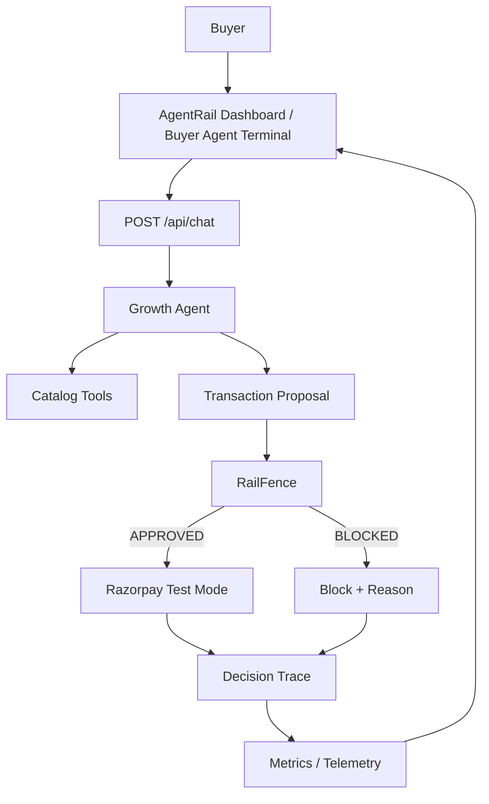

# AgentRail

AgentRail is a merchant-side AI Growth Agent system that identifies upsell and bundle opportunities during buyer interactions while placing all transaction execution behind a deterministic policy boundary.

## Overview

In agentic commerce, AI buyer agents interact directly with merchant interfaces to negotiate and purchase goods. While generative LLMs excel at understanding natural language buyer intent, engaging in conversational sales, and discovering growth opportunities, allowing non-deterministic AI models to execute financial transactions or approve pricing directly presents significant financial risks, such as loss-making discounts, unauthorized price overrides, or runaway agent sessions.

AgentRail solves this by strictly separating non-deterministic LLM reasoning from deterministic transaction execution:
- The **Growth Agent** reasons about buyer intent using natural language, explores product catalogs, and constructs structured **Transaction Proposals** (including recommended items, volume discounts, or bundles).
- The agent **cannot** directly execute payments, invoke payment gateways, or make policy decisions.
- The **RailFence Policy Engine** receives the proposed JSON transaction contract and deterministically evaluates it against strict merchant guardrails (maximum discount thresholds, floor price margin protection, and session velocity limits).
- If **APPROVED**, the backend issues a deterministic SHA-256 contract hash and creates a test order via the Razorpay SDK (in test mode).
- If **BLOCKED**, payment execution is completely bypassed (zero Razorpay SDK calls), and the block reason is recorded into an immutable decision trace.

## Key Features

- **LLM Growth Agent**: Analyzes buyer prompts and catalog relationships to identify upsell, cross-sell, and bundle opportunities using natural language processing via an OpenAI-compatible API (Groq).
- **RailFence Policy Engine**: A deterministic policy engine that enforces non-negotiable financial guardrails (margin protection, max discount rates, single-session velocity caps).
- **Deterministic Contract Hashing**: SHA-256 hash generation over canonical proposal parameters attached directly to payment order metadata for end-to-end contract validation.
- **Payment Safety Boundary**: Enforces zero payment SDK calls unless a proposal is explicitly approved by RailFence. AgentRail operates strictly in Razorpay Test Mode to generate test orders; no live financial or customer payment transactions are processed. Payment credentials and order creation reside strictly on the backend.
- **Zero-Leakage Architecture**: Internal floor prices, cost bases, and margin calculations are strictly isolated on the server. Public API responses, telemetry endpoints, and frontend traces are automatically sanitized.
- **Decision Tracing & Telemetry**: Immutable JSON-backed decision logs capturing execution timestamps, negotiation duration, policy check details, and calculated metrics (AOV, growth uplift, block distribution).
- **Interactive Dashboard UI**: Dual-panel React/Tailwind frontend featuring a real-time Buyer Agent Terminal and a Telemetry Dashboard for live decision trace analysis and policy administration.

## System Architecture



### Component Breakdown

1. **Buyer Agent Terminal (Frontend)**: Real-time chat panel where buyers interact with the Growth Agent. Displays conversational responses, generated proposal summaries, policy validation badges, and payment statuses.
2. **Growth Agent (`backend/src/agent`)**: Configured with system instructions and custom catalog tools (`search_products`, `get_product_details`, `create_transaction_proposal`) to explore products and construct proposals without payment authority.
3. **RailFence Policy Engine (`backend/src/gateway`)**: Pure TypeScript validation module checking proposals against configurable merchant rules:
   - `MAX_DISCOUNT_PERCENT`: Cap on percentage discount per item/order.
   - `MIN_MARGIN_PERCENT`: Protection against selling below merchant cost boundaries.
   - `MAX_PROPOSALS_PER_SESSION`: Velocity restriction preventing automated negotiation spam.
4. **Payment Gateway (`backend/src/payments`)**: Server-side Razorpay Test Mode integration. Creates test orders exclusively for approved proposals without processing live customer payments. Attaches the RailFence SHA-256 contract hash to order metadata for auditability.
5. **Telemetry & Audit Engine (`backend/src/telemetry`)**: Computes real-time financial metrics (Average Order Value, Growth Uplift Percentage, Block Reason Distributions) from stored sanitized traces.

## Repository Structure

```text
agentrail/
├── backend/
│   ├── data/              # Storage directory for decision traces
│   ├── src/
│   │   ├── agent/         # Growth Agent logic, tools, and execution runner
│   │   ├── catalog/       # Product catalog dataset & in-memory database engine
│   │   ├── gateway/       # RailFence Policy Engine & guardrail rules
│   │   ├── payments/      # Razorpay test integration & contract hashing
│   │   ├── routes/        # Express REST API routes (/api/chat, /metrics, /traces)
│   │   ├── telemetry/     # Audit logging & metrics aggregation engine
│   │   ├── config.ts      # Environment configuration loader
│   │   └── server.ts      # Express application entry point
│   ├── tests/             # Unit and integration test suite
│   └── package.json
├── frontend/
│   ├── src/
│   │   ├── components/    # ChatPanel, MetricsOverview, BlockDistribution, PolicyAdminView, TraceLogTable
│   │   ├── hooks/         # Custom React hooks (useTelemetry)
│   │   ├── types/         # TypeScript interface definitions
│   │   ├── App.tsx        # Dashboard layout & dual-panel container
│   │   └── main.tsx
│   ├── package.json
│   └── vite.config.ts
├── .gitignore
├── package.json           # Monorepo root package configuration
└── README.md
```

## API Specification

### 1. `POST /api/chat`
Processes buyer input, invokes the Growth Agent, evaluates any resulting proposal against RailFence, and optionally triggers test payment order creation.

**Request Body:**
```json
{
  "message": "I'm looking for a professional camera setup for portrait photography.",
  "sessionId": "sess_buyer_01",
  "buyerId": "buyer_default"
}
```

**Response (Approved Example):**
```json
{
  "success": true,
  "text": "I recommend the Lumix S5 II with the 85mm f/1.8 lens. I've put together a portrait bundle with a discount.",
  "proposal": {
    "proposalId": "prop_1725280000000",
    "sessionId": "sess_buyer_01",
    "buyerId": "buyer_default",
    "items": [
      {
        "productId": "cam_lumix_s5ii",
        "quantity": 1,
        "proposedUnitPrice": 1799.99,
        "discountPercent": 10
      }
    ],
    "totalProposedPrice": 1619.99
  },
  "evaluation": {
    "status": "APPROVED",
    "contractHash": "a8f5f167f44f4964e6c998dee827110c...",
    "policyChecks": [
      { "rule": "MAX_DISCOUNT_PERCENT", "passed": true, "details": "Discount 10.0% within limit 20%" },
      { "rule": "FLOOR_PRICE_BOUND", "passed": true, "details": "Price meets margin requirements" },
      { "rule": "SESSION_VELOCITY", "passed": true, "details": "Proposal 1 within session limit 5" }
    ]
  },
  "razorpayOrder": {
    "success": true,
    "orderId": "order_NzE5MzM5...",
    "amount": 161999,
    "currency": "INR",
    "contractHash": "a8f5f167f44f4964e6c998dee827110c..."
  },
  "traceId": "trace_1725280000000_abc"
}
```

### 2. `GET /api/metrics`
Returns aggregated growth and telemetry metrics (AOV, Growth Uplift %, Approved/Blocked counts) computed dynamically from decision traces.

### 3. `GET /api/traces`
Returns sanitized historical decision logs for telemetry audit logs and dashboard tables.

## Getting Started

### Prerequisites

- Node.js (v18 or higher)
- npm (v9 or higher with workspaces support)
- A Groq API Key (or OpenAI-compatible API key) for Growth Agent execution.

### Environment Setup

Create a `.env` file in the project root directory:

```env
PORT=3001
GROQ_API_KEY=your_groq_api_key_here
RAZORPAY_KEY_ID=rzp_test_your_key_id
RAZORPAY_KEY_SECRET=your_razorpay_secret
```

*Note: If Razorpay credentials are omitted or unconfigured, the system gracefully falls back to simulated test mode responses, ensuring full offline functionality.*

### Installation & Local Development

1. **Install dependencies across workspaces:**
   ```bash
   npm install
   ```

2. **Run Backend and Frontend concurrently:**
   ```bash
   npm run dev
   ```
   - Backend service runs on `http://localhost:3001`
   - Frontend dashboard runs on `http://localhost:5173`

3. **Build production bundles:**
   ```bash
   npm run build
   ```

### Running Tests

To run the backend test suite:
```bash
npm run build:backend
npm run test:backend
```

## Security & Data Privacy Boundary

AgentRail enforces strict isolation of sensitive merchant financial data:
- **Floor Prices & Cost Structures**: Cost bases and minimum floor prices exist strictly in server memory (`backend/src/catalog`) and are never included in LLM agent prompts or returned in public API payloads.
- **Trace Sanitization**: All decision trace records pass through `sanitizeTrace()` before being logged or exposed via `/api/traces`, removing any private financial metrics.
- **Payment Credential Isolation**: Razorpay API secrets reside exclusively on the server and are never accessible to client applications.
