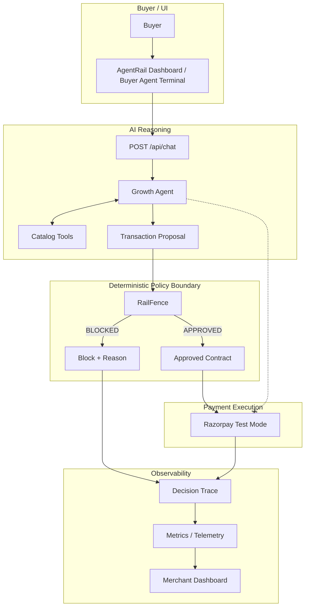

# AgentRail

AgentRail is a merchant-side AI Growth Agent for agentic commerce. It understands buyer intent, discovers products, identifies legitimate upsell and cross-sell opportunities, and autonomously builds transaction proposals. A deterministic RailFence policy boundary then validates those proposals against merchant-defined financial rules before any Razorpay Test Mode order is created.

## The Problem

Agentic commerce allows AI agents to understand buyer intent, discover products, recommend complementary products, negotiate, and prepare purchases.

For merchants, this creates an opportunity to use AI as an active sales layer rather than only as a chatbot or product search tool.

The Growth Agent can increase transaction value through relevant upsells, cross-sells, bundles, upgrades, and negotiated offers.

However, the LLM should not have authority to decide whether a financially meaningful proposal is acceptable to the merchant.

The merchant therefore needs both:
- AI-driven growth
- deterministic financial control

## The Solution

AgentRail is a merchant-side AI Growth Agent for agentic commerce.

The Growth Agent understands the buyer's intent, searches the real catalog, selects relevant products, identifies legitimate growth opportunities, negotiates where appropriate, and autonomously creates a structured Transaction Proposal.

The buyer does not need to manually construct the cart in this flow.

The Growth Agent does not have financial authority.

Its proposal is passed to RailFence, which deterministically validates it against merchant-configured boundaries and private floor-price protection.

Only approved proposals reach Razorpay Test Mode.

**AI proposes. RailFence decides. Razorpay executes only after approval.**

## How AgentRail Works



## Architecture Explained

### 1. Buyer Agent Terminal
A real-time chat interface where buyers interact with the Growth Agent. It handles natural language input and renders the agent's responses along with structured proposal cards.

### 2. Growth Agent
The LLM-powered intelligence layer (built on OpenAI Agents SDK, currently configured for Groq). It understands buyer intent, searches the catalog, identifies legitimate growth opportunities (upsell, cross-sell, bundle, upgrade), and curates a structured proposal. It does **not** execute payments or make final policy decisions.

### 3. Catalog Tools
Deterministic functions (`search_products`, `get_product`, `get_related_products`) that the Growth Agent uses to retrieve factual product data. The agent is strictly grounded in this real catalog data.

### 4. Transaction Proposal
A structured JSON contract generated by the Growth Agent containing the selected SKUs, quantities, negotiated prices, applied discounts, and growth actions.

### 5. RailFence
The deterministic security boundary. It receives the Transaction Proposal and validates it against merchant-configured limits. If a proposal fails validation, it is blocked immediately before reaching the payment gateway.

RailFence enforces the following actual policy boundaries:
- **Maximum Discount**: `maxDiscountPercent`
- **Maximum Transaction Amount**: `maxTransactionAmount`
- **Maximum Orders Per Session**: `maxOrdersPerSession`
- **Maximum Spend Per Session**: `maxSpendPerSession`
- **Private Floor-Price Protection**: `strictFloorPriceCheck` (Ensures items are never sold below merchant cost). Floor prices are private merchant information and are never exposed to the Growth Agent, frontend, public API responses, or sanitized telemetry.

### 6. Razorpay Test Mode
The payment execution layer. It is called **only** after RailFence approval. It receives the approved transaction as a test order and attaches a SHA-256 deterministic contract hash to the order metadata. Blocked proposals result in zero Razorpay API calls.

### 7. Decision Trace and Telemetry
Records the outcome of every decision, providing full explainability. Traces are securely sanitized to prevent exposing private merchant floor prices or internal financial information.

### 8. Merchant Policy Administration
A dashboard interface allowing the merchant to configure limits (discount caps, session velocity). Floor-price protection remains private and cannot be disabled or modified through the public policy interface.

## How the Growth Agent Creates Revenue Uplift

The Growth Agent is not simply a product recommender.

It actively looks for legitimate opportunities to increase transaction value while remaining aligned with the buyer's original intent.

- Understand the buyer's primary intent.
- Search the real catalog.
- Select suitable products.
- Identify related products.
- Recommend relevant upgrades.
- Identify cross-sell opportunities.
- Construct relevant bundles.
- Negotiate within the proposal it generates.
- Convert the result into a structured Transaction Proposal.

Growth actions are represented in the proposal/decision trace.

Growth uplift is calculated deterministically from transaction data rather than being claimed by the LLM.

> Find legitimate ways to grow the transaction without losing relevance to the buyer.

RailFence provides the independent financial boundary around that autonomous growth behavior.

## End-to-End Transaction Flow

1. Buyer gives a natural-language request.
2. Growth Agent understands the buyer's primary intent.
3. Growth Agent searches the real catalog.
4. Growth Agent evaluates suitable products and related opportunities.
5. Growth Agent identifies relevant upsell, cross-sell, bundle, or upgrade opportunities.
6. Growth Agent autonomously creates a structured Transaction Proposal.
7. RailFence deterministically validates the proposal against merchant policies and private floor-price protection.
8. If approved, a SHA-256 contract hash is generated and the transaction proceeds to Razorpay Test Mode.
9. Growth uplift, policy checks, payment activity, and the final decision are recorded in telemetry.
10. If blocked, the transaction stops before Razorpay and the enforcement reason is recorded.

## Why RailFence Matters

The Growth Agent is intentionally given autonomy over reasoning and sales recommendations.

RailFence is intentionally given authority over financial enforcement.

The Growth Agent answers:
"What would be a good transaction for this buyer?"

RailFence answers:
"Is this transaction allowed under the merchant's rules?"

| Responsibility | Growth Agent | RailFence |
|---|---|---|
| Intent understanding | Yes | No |
| Product discovery | Yes | No |
| Product recommendation | Yes | No |
| Growth opportunity identification | Yes | No |
| Upsell / cross-sell / bundle / upgrade reasoning | Yes | No |
| Negotiation / proposal generation | Yes | No |
| Policy enforcement | No | Yes |
| Floor-price protection | No | Yes |
| Discount validation | No | Yes |
| Session-limit enforcement | No | Yes |
| Transaction amount validation | No | Yes |
| Payment authorization boundary | No | Yes |

*Note: Razorpay order creation is handled by the backend after RailFence approval.*

## Failure Handling

If a buyer requests a discount beyond the merchant's configured limit, the flow halts gracefully:

Buyer request → Growth Agent creates proposal → RailFence detects violation → **BLOCKED** → Reason returned safely → Zero Razorpay SDK calls → Decision trace recorded.

Implemented RailFence error reasons include:
- `SCHEMA_VIOLATION`
- `UNKNOWN_SKU`
- `RECALCULATION_MISMATCH`
- `FLOOR_PRICE_VIOLATION`
- `DISCOUNT_LIMIT_EXCEEDED`
- `TRANSACTION_AMOUNT_EXCEEDED`
- `VELOCITY_LIMIT_EXCEEDED`

## Explainability and Merchant Control

The dashboard lets the merchant observe what the Growth Agent attempted, what value it created, and whether RailFence allowed the resulting transaction to proceed.

The merchant should be able to see:
- AOV
- growth uplift amount and percentage
- agent actions
- policy violations
- approved/blocked transactions
- Razorpay activity
- negotiation timing
- decision traces
- contract hashes

Merchants can configure policy limits dynamically through the dashboard. Floor-price protection remains securely locked on the server side.

## Security and Data Boundaries

These safeguards act as the control layer that makes autonomous AI growth safe.

- **Floor prices remain server-side**: Private merchant data is never exposed to the client, the LLM, or the frontend.
- **Secrets remain backend-only**: API keys and Razorpay credentials are never exposed.
- **Traces are sanitized**: All telemetry data exposed to the frontend is scrubbed of sensitive information.
- **Blocked proposals cannot call Razorpay**: The deterministic gateway prevents unauthorized API calls.
- **Razorpay is Test Mode only**: The system is explicitly configured to use Razorpay test credentials.

## API

### `POST /api/chat`
The primary entry point connecting the Buyer UI to the Growth Agent and RailFence pipeline.
- **Request Body:** `{ "message": "string", "sessionId": "string", "buyerId": "string" }`
- **Response (Approved):**
  ```json
  {
    "success": true,
    "text": "Agent's response message...",
    "proposal": {
      "transactionId": "...",
      "sessionId": "...",
      "items": [...],
      "proposedDiscountPercent": 10,
      "proposedTotal": 1500
    },
    "evaluation": {
      "status": "APPROVED",
      "transactionId": "...",
      "contractHash": "...",
      "reasons": [],
      "checks": { "schemaValid": true, "skusValid": true, "mathValid": true, "floorPriceValid": true, "discountValid": true, "velocityValid": true }
    },
    "razorpayOrder": {
      "id": "order_...",
      "amount": 150000,
      "status": "created"
    },
    "traceId": "..."
  }
  ```

### `GET /api/policy`
Exposes the active merchant-configured RailFence limits.
- **Response:** `{ "success": true, "policy": { "maxDiscountPercent": 25, "maxTransactionAmount": 200000, "maxOrdersPerSession": 3, "maxSpendPerSession": 300000, "strictFloorPriceCheck": true } }`

### `PUT /api/policy`
Updates the active merchant policy limits.

### `GET /api/metrics`
Exposes aggregated growth telemetry metrics.

### `GET /api/traces`
Exposes sanitized historical decision traces for the dashboard audit log.

### `GET /api/health`
Returns backend health status.

## Repository Structure

```text
agentrail/
├── backend/
│   ├── Dockerfile
│   ├── package.json
│   ├── src/
│   │   ├── agent/         # Growth Agent logic and tools
│   │   ├── catalog/       # In-memory DB and catalog tools
│   │   ├── gateway/       # RailFence deterministic policy engine
│   │   ├── payments/      # Razorpay Test Mode integration
│   │   ├── routes/        # Express REST API routes
│   │   └── telemetry/     # Audit logging and metrics
│   └── tests/             # Verification tests
├── frontend/
│   ├── Dockerfile
│   ├── package.json
│   ├── src/
│   │   ├── components/    # React components (Dashboard, Terminal, Traces)
│   │   └── index.css      # Tailwind styles
│   └── vite.config.ts
├── docker-compose.yml
└── package.json
```

## Tech Stack

- **Frontend**: React, TypeScript, Vite, Tailwind CSS
- **Backend**: Node.js, Express, TypeScript, Zod
- **AI/LLM**: OpenAI Agents SDK (configured with Groq via OpenAI-compatible API)
- **Payments**: Razorpay Node.js SDK
- **Telemetry**: JSON-backed in-memory storage
- **Deployment**: Docker, Docker Compose

## Running Locally

### Prerequisites
- Node.js (v20+) and npm
- Groq API Key
- Razorpay Test Mode Credentials

### Environment Variables
Create a `.env` file in the root directory:
```env
PORT=3000
GROQ_API_KEY=your_groq_api_key_here
RAZORPAY_KEY_ID=your_razorpay_test_key_id
RAZORPAY_KEY_SECRET=your_razorpay_test_secret
```

### Starting the Development Environment
1. Install dependencies:
   ```bash
   npm install
   ```
2. Start the application concurrently:
   ```bash
   npm run dev
   ```
   - Frontend runs on `http://localhost:5173`
   - Backend runs on `http://localhost:3000`

### Building for Production
```bash
npm run build
```

### Production Docker Setup
AgentRail has been containerized for production deployment. The Docker configuration has been statically reviewed for secure context boundaries (note: not locally executed in this environment).
```bash
docker compose up --build -d
docker compose logs -f
docker compose down
```
- Frontend: `http://localhost:8080`
- Backend: `http://localhost:3000`

## Testing and Verification

Run the backend test suite:
```bash
npm run test:backend
```
Tests in `backend/tests/` verify:
- Agent catalog tool responses and correctness.
- `TransactionProposal` generation and validation.

## Design Principles

1. **AI for reasoning, deterministic code for enforcement.**
2. **Merchant control over financial boundaries.**
3. **No payment execution before policy approval.**
4. **Private financial data stays server-side.**
5. **Every transaction decision is traceable.**
6. **Test Mode only.**

## Project Status

The core AgentRail flow is fully implemented. The system correctly isolates the LLM Growth Agent from the RailFence policy gateway and successfully processes or blocks transactions based on merchant rules. The project is explicitly designed for Razorpay Test Mode.
