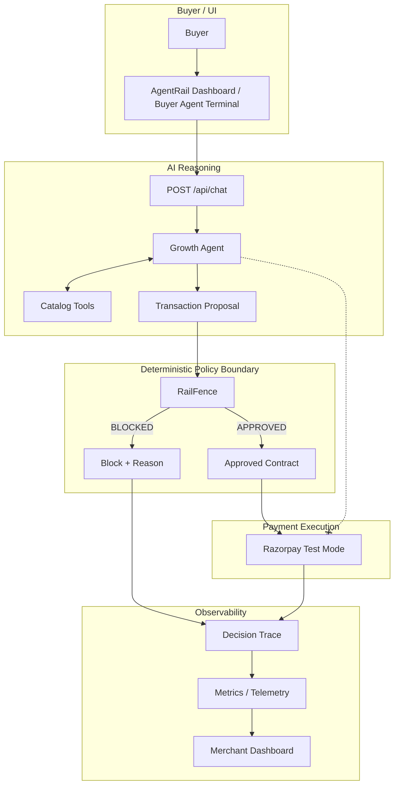

# AgentRail

AgentRail is a merchant-side AI Growth Agent for agentic commerce designed to safely automate sales and negotiations. It empowers merchants to use advanced LLMs to recommend products and negotiate deals while strictly enforcing deterministic financial boundaries before any payment is executed.

## The Problem

AI buyer agents can understand intent, search catalogs, and negotiate naturally, but giving a non-deterministic Large Language Model (LLM) direct authority over financial transactions creates immense risk. A growth agent might hallucinate incorrect pricing, offer unauthorized discounts, or attempt to sell items below cost. The merchant needs the intelligence of an AI to drive sales, but requires deterministic control over what can actually become a finalized transaction.

## The Solution

AgentRail solves this by separating AI reasoning from transaction authority. 

**AI proposes. RailFence decides. Razorpay executes only after approval.**

The system is split into distinct layers:
- The **Growth Agent** handles conversation, intent understanding, and proposal generation.
- **RailFence** acts as a deterministic policy boundary that evaluates proposals against merchant rules.
- **Razorpay** (in Test Mode) is only ever called if RailFence explicitly approves the transaction.

## How AgentRail Works



## Architecture Explained

### 1. Buyer Agent Terminal
A real-time chat interface where buyers interact with the Growth Agent. It handles natural language input and renders the agent's responses along with structured proposal cards.

### 2. Growth Agent
The LLM-powered intelligence layer (built on OpenAI Agents SDK, currently configured for Groq). It understands buyer intent, searches the catalog, identifies legitimate growth opportunities (upsell, cross-sell, bundle, upgrade), and curates a structured proposal. It does **not** execute payments or make final policy decisions.

### 3. Catalog Tools
Deterministic functions (`search_products`, `get_product`, `get_related_products`) that the Growth Agent uses to retrieve factual product data. The agent is strictly grounded in this real catalog data.

### 4. Transaction Proposal
A structured JSON contract generated by the Growth Agent containing the selected SKUs, quantities, negotiated prices, applied discounts, and growth actions.

### 5. RailFence
The deterministic security boundary. It receives the Transaction Proposal and validates it against merchant-configured limits. If a proposal fails validation, it is blocked immediately before reaching the payment gateway.

RailFence enforces the following actual policy boundaries:
- **Maximum Discount**: `maxDiscountPercent`
- **Maximum Transaction Amount**: `maxTransactionAmount`
- **Maximum Orders Per Session**: `maxOrdersPerSession`
- **Maximum Spend Per Session**: `maxSpendPerSession`
- **Private Floor-Price Protection**: `strictFloorPriceCheck` (Ensures items are never sold below merchant cost). Floor prices are private merchant information and are never exposed to the Growth Agent, frontend, public API responses, or sanitized telemetry.

### 6. Razorpay Test Mode
The payment execution layer. It is called **only** after RailFence approval. It receives the approved transaction as a test order and attaches a SHA-256 deterministic contract hash to the order metadata. Blocked proposals result in zero Razorpay API calls.

### 7. Decision Trace and Telemetry
Records the outcome of every decision, providing full explainability. Traces are securely sanitized to prevent exposing private merchant floor prices or internal financial information.

### 8. Merchant Policy Administration
A dashboard interface allowing the merchant to configure limits (discount caps, session velocity). Floor-price protection remains private and cannot be disabled or modified through the public policy interface.

## End-to-End Transaction Flow

1. Buyer gives a natural-language request (e.g., "I need a portrait camera setup within 200000").
2. Growth Agent interprets intent.
3. Growth Agent searches the real catalog using catalog tools.
4. Growth Agent selects relevant products and identifies a legitimate growth opportunity.
5. Growth Agent autonomously creates a structured Transaction Proposal in the same turn (the buyer does not manually construct a cart).
6. RailFence validates the proposal deterministically against merchant limits and private floor prices.
7. If approved, a SHA-256 contract hash is generated.
8. Razorpay Test Mode creates the order with the contract hash attached.
9. The decision is recorded in telemetry.
10. If blocked, the process stops before Razorpay and the reason is recorded.

## Why RailFence Matters

The key design principle of AgentRail is: **The LLM is responsible for reasoning and recommendations, while deterministic code is responsible for financial enforcement.**

| Responsibility | Growth Agent | RailFence |
| :--- | :--- | :--- |
| Intent understanding | Yes | No |
| Product discovery & Catalog search | Yes | No |
| Identifying growth opportunities | Yes | No |
| Generating a transaction proposal | Yes | No |
| Policy enforcement | No | Yes |
| Floor-price protection | No | Yes |
| Discount validation | No | Yes |
| Session limits enforcement | No | Yes |
| Payment authorization boundary | No | Yes |

*Note: Razorpay order creation is handled by the backend after RailFence approval.*

## Failure Handling

If a buyer requests a discount beyond the merchant's configured limit, the flow halts gracefully:

Buyer request → Growth Agent creates proposal → RailFence detects violation → **BLOCKED** → Reason returned safely → Zero Razorpay SDK calls → Decision trace recorded.

Implemented RailFence error reasons include:
- `SCHEMA_VIOLATION`
- `UNKNOWN_SKU`
- `RECALCULATION_MISMATCH`
- `FLOOR_PRICE_VIOLATION`
- `DISCOUNT_LIMIT_EXCEEDED`
- `TRANSACTION_AMOUNT_EXCEEDED`
- `VELOCITY_LIMIT_EXCEEDED`

## Explainability and Merchant Control

Through the AgentRail dashboard, merchants have complete visibility and control. They can monitor:
- Average Order Value (AOV)
- Growth uplift
- Agent actions (upsells, cross-sells)
- Razorpay activity
- Policy violations and blocked transactions
- Transaction outcomes and negotiation timing
- Decision traces and contract hashes

Merchants can configure policy limits dynamically through the dashboard. Floor-price protection remains securely locked on the server side.

## Security and Data Boundaries

- **Floor prices remain server-side**: Private merchant data is never exposed to the client, the LLM, or the frontend.
- **Secrets remain backend-only**: API keys and Razorpay credentials are never exposed.
- **Traces are sanitized**: All telemetry data exposed to the frontend is scrubbed of sensitive information.
- **Blocked proposals cannot call Razorpay**: The deterministic gateway prevents unauthorized API calls.
- **Razorpay is Test Mode only**: The system is explicitly configured to use Razorpay test credentials.

## API

### `POST /api/chat`
The primary entry point connecting the Buyer UI to the Growth Agent and RailFence pipeline.
- **Request Body:** `{ "message": "string", "sessionId": "string", "buyerId": "string" }`
- **Response (Approved):**
  ```json
  {
    "success": true,
    "text": "Agent's response message...",
    "proposal": {
      "transactionId": "...",
      "sessionId": "...",
      "items": [...],
      "proposedDiscountPercent": 10,
      "proposedTotal": 1500
    },
    "evaluation": {
      "status": "APPROVED",
      "transactionId": "...",
      "contractHash": "...",
      "reasons": [],
      "checks": { "schemaValid": true, "skusValid": true, "mathValid": true, "floorPriceValid": true, "discountValid": true, "velocityValid": true }
    },
    "razorpayOrder": {
      "id": "order_...",
      "amount": 150000,
      "status": "created"
    },
    "traceId": "..."
  }
  ```

### `GET /api/policy`
Exposes the active merchant-configured RailFence limits.
- **Response:** `{ "success": true, "policy": { "maxDiscountPercent": 25, "maxTransactionAmount": 200000, "maxOrdersPerSession": 3, "maxSpendPerSession": 300000, "strictFloorPriceCheck": true } }`

### `PUT /api/policy`
Updates the active merchant policy limits.

### `GET /api/metrics`
Exposes aggregated growth telemetry metrics.

### `GET /api/traces`
Exposes sanitized historical decision traces for the dashboard audit log.

### `GET /api/health`
Returns backend health status.

## Repository Structure

```text
agentrail/
├── backend/
│   ├── Dockerfile
│   ├── package.json
│   ├── src/
│   │   ├── agent/         # Growth Agent logic and tools
│   │   ├── catalog/       # In-memory DB and catalog tools
│   │   ├── gateway/       # RailFence deterministic policy engine
│   │   ├── payments/      # Razorpay Test Mode integration
│   │   ├── routes/        # Express REST API routes
│   │   └── telemetry/     # Audit logging and metrics
│   └── tests/             # Verification tests
├── frontend/
│   ├── Dockerfile
│   ├── package.json
│   ├── src/
│   │   ├── components/    # React components (Dashboard, Terminal, Traces)
│   │   └── index.css      # Tailwind styles
│   └── vite.config.ts
├── docker-compose.yml
└── package.json
```

## Tech Stack

- **Frontend**: React, TypeScript, Vite, Tailwind CSS
- **Backend**: Node.js, Express, TypeScript, Zod
- **AI/LLM**: OpenAI Agents SDK (configured with Groq via OpenAI-compatible API)
- **Payments**: Razorpay Node.js SDK
- **Telemetry**: JSON-backed in-memory storage
- **Deployment**: Docker, Docker Compose

## Running Locally

### Prerequisites
- Node.js (v20+) and npm
- Groq API Key
- Razorpay Test Mode Credentials

### Environment Variables
Create a `.env` file in the root directory:
```env
PORT=3000
GROQ_API_KEY=your_groq_api_key_here
RAZORPAY_KEY_ID=your_razorpay_test_key_id
RAZORPAY_KEY_SECRET=your_razorpay_test_secret
```

### Starting the Development Environment
1. Install dependencies:
   ```bash
   npm install
   ```
2. Start the application concurrently:
   ```bash
   npm run dev
   ```
   - Frontend runs on `http://localhost:5173`
   - Backend runs on `http://localhost:3000`

### Building for Production
```bash
npm run build
```

### Production Docker Setup
AgentRail has been containerized for production deployment. The Docker configuration has been statically reviewed for secure context boundaries (note: not locally executed in this environment).
```bash
docker compose up --build -d
docker compose logs -f
docker compose down
```
- Frontend: `http://localhost:8080`
- Backend: `http://localhost:3000`

## Testing and Verification

Run the backend test suite:
```bash
npm run test:backend
```
Tests in `backend/tests/` verify:
- Agent catalog tool responses and correctness.
- `TransactionProposal` generation and validation.

## Design Principles

1. **AI for reasoning, deterministic code for enforcement.**
2. **Merchant control over financial boundaries.**
3. **No payment execution before policy approval.**
4. **Private financial data stays server-side.**
5. **Every transaction decision is traceable.**
6. **Test Mode only.**

## Project Status

The core AgentRail flow is fully implemented. The system correctly isolates the LLM Growth Agent from the RailFence policy gateway and successfully processes or blocks transactions based on merchant rules. The project is explicitly designed for Razorpay Test Mode.
